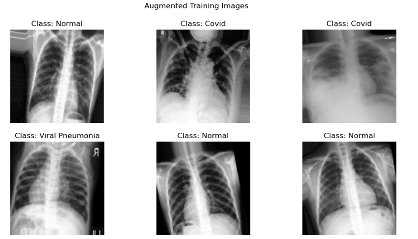
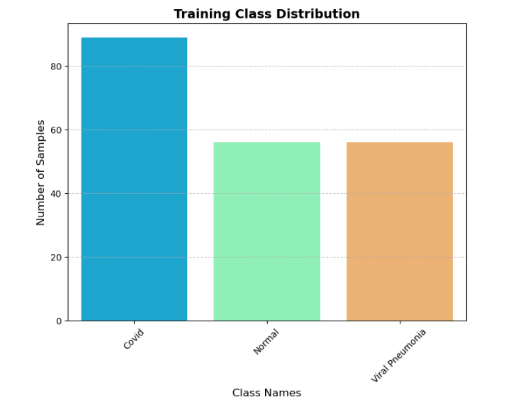
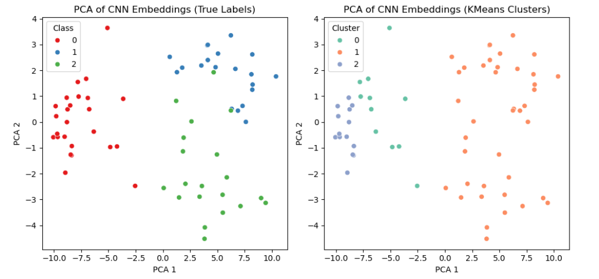

# COVID-19 Diagnosis from Chest X-Rays using Deep Learning & Machine Learning

An AI-powered medical imaging pipeline for classifying chest X-ray images into **COVID-19**, **Viral Pneumonia**, and **Normal** categories using Deep Learning and Machine Learning techniques.

---

# 📖 Project Overview

This project develops an end-to-end AI pipeline for automated chest X-ray classification to support the detection of respiratory diseases. It compares Deep Learning and Classical Machine Learning approaches by combining a custom Convolutional Neural Network (CNN) with feature extraction, supervised learning, and unsupervised learning techniques.

The project was completed as part of my MSc Data Science coursework and demonstrates the complete machine learning lifecycle, including data preprocessing, model development, evaluation, and visualisation.

---

# 🎯 Business Problem

Accurate and timely diagnosis of respiratory diseases such as COVID-19 is essential for effective patient care. Manual interpretation of chest X-ray images requires specialist expertise and can become challenging during periods of high patient demand.

This project explores how Artificial Intelligence can assist healthcare professionals by automatically classifying chest X-ray images and comparing multiple AI models to identify the most effective approach for disease detection.

---

# 📂 Dataset

**Source:** COVID-19 Image Dataset (Kaggle)

https://www.kaggle.com/datasets/pranavraikokte/covid19-image-dataset

The dataset contains chest X-ray images belonging to three categories:

- COVID-19
- Viral Pneumonia
- Normal

> **Note:** The dataset is not included in this repository due to GitHub storage limitations. Please download it from Kaggle and place it in the following directory:

```text
data/raw/Covid19-dataset/
```

---

# 🛠️ Tools & Technologies

- Python
- TensorFlow / Keras
- Scikit-learn
- OpenCV
- NumPy
- Pandas
- Matplotlib
- Seaborn

---

# 🔄 Project Workflow

```text
Chest X-ray Images
        │
        ▼
Image Preprocessing
        │
        ▼
Data Augmentation
        │
        ▼
CNN Model Training
        │
        ▼
CNN Feature Extraction
        │
        ▼
MLP & Random Forest Classification
        │
        ▼
Hyperparameter Tuning (GridSearchCV)
        │
        ▼
Model Evaluation
        │
        ▼
K-Means Clustering & PCA Visualisation
```

---

# 📊 Model Performance

| Model | Validation Accuracy |
|--------|--------------------:|
| CNN | ~92% |
| MLP (CNN Features) | 100% |
| Random Forest (CNN Features) | 100% |
| K-Means (Raw Pixels) | 76% |
| K-Means (CNN Features) | 62% |

---

---

# 📸 Results & Visualisations

## Data Augmentation

The training dataset was augmented to improve model generalisation and reduce overfitting by generating transformed versions of the original chest X-ray images.

<p align="center">
  
</p>

---

## Training Dataset Distribution

The dataset was analysed to verify the distribution of images across the three classes before model training.

<p align="center">
  
</p>

---

## PCA Visualisation of CNN Embeddings

Principal Component Analysis (PCA) was applied to CNN-generated feature embeddings to compare the true class labels with K-Means clustering results. The visualisation illustrates how effectively the CNN learned discriminative feature representations for chest X-ray classification.

<p align="center">
  
</p>

---

# 💡 Key Findings

- CNN feature extraction significantly improved the performance of traditional machine learning models, enabling both the MLP and Random Forest classifiers to achieve perfect validation accuracy on the evaluation dataset.
- Deep learning-generated image embeddings provided more informative features than raw pixel values, resulting in substantially higher classification performance.
- K-Means clustering demonstrated lower classification accuracy than supervised learning models, highlighting the importance of labelled data for reliable medical image classification.

---

# 📈 Business Impact

Although developed for academic purposes, this project demonstrates how AI can support healthcare by:

- Assisting clinicians with faster preliminary screening of chest X-ray images.
- Reducing manual effort through automated image classification.
- Providing a foundation for future Computer-Aided Diagnosis (CAD) systems.

---

# 📁 Repository Structure

```text
covid19-xray-diagnosis-ai/
│
├── data/
├── notebooks/
├── plots/
├── reports/
├── README.md
└── .gitignore
```

---

# 🚀 Skills Demonstrated

- Deep Learning
- Convolutional Neural Networks (CNN)
- Medical Image Classification
- Feature Extraction
- Machine Learning
- Random Forest
- Multilayer Perceptron (MLP)
- Hyperparameter Tuning (GridSearchCV)
- K-Means Clustering
- Principal Component Analysis (PCA)
- Data Augmentation
- Model Evaluation
- Data Visualisation

---

# 🔮 Future Improvements

- Implement Transfer Learning using ResNet50 or EfficientNet.
- Integrate Explainable AI techniques such as Grad-CAM for model interpretability.
- Evaluate model performance on larger and more diverse medical imaging datasets.
- Deploy the solution as a web application for real-time inference.

---

# 👤 Author

**Nithyashree Nataraja**

**Data Analyst | SQL | Python | Power BI | Data Visualization**
